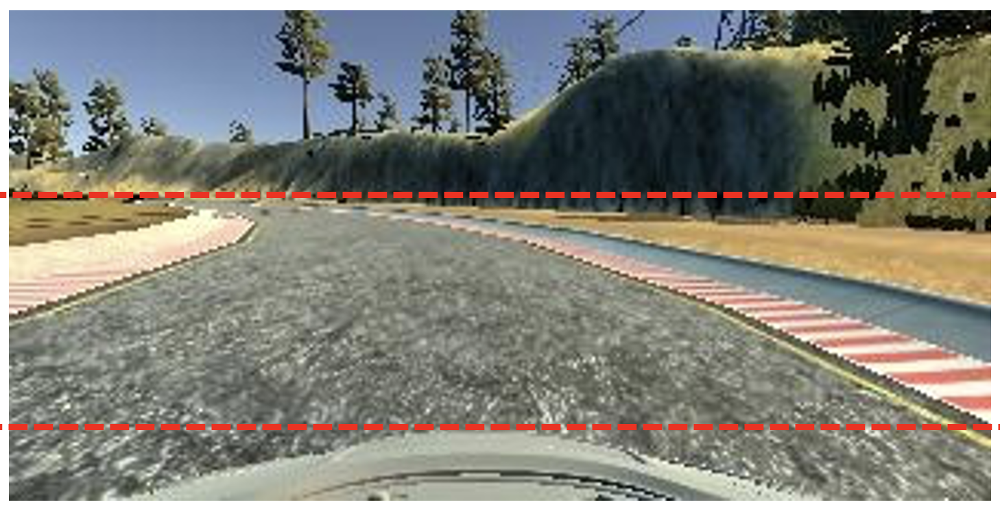
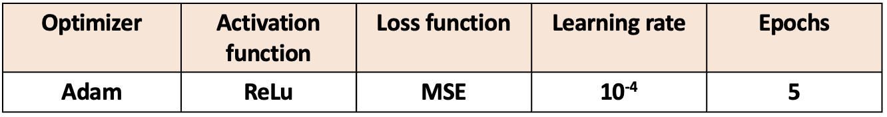
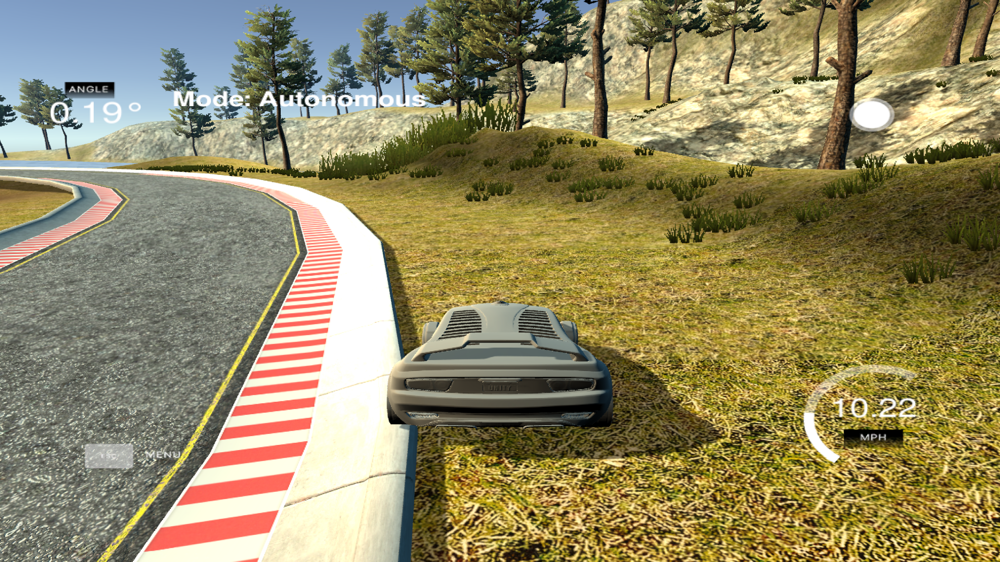

# Behavioral-Cloning-Project

## Table of Contents
1. [Prerequisites](#prerequisites)
2. [Abstract](#abstract)
3. [Motivation](#motivation)
4. [Implementation](#implementation)
5. [Evaluation](#evaluation)
6. [Results](#results)
7. [References](#references)

## Prerequisites
1. Linux OS (preferably Ubuntu)
2. Download simulator [here](https://s3-us-west-1.amazonaws.com/udacity-selfdrivingcar/Term1-Sim/term1-simulator-linux.zip)
3. Miniconda [here](https://repo.continuum.io/miniconda/Miniconda3-latest-Linux-x86_64.sh)
4. run `conda env create -f environment-gpu.yml` to create environment and install dependencies
5. Download Data from [data file link](https://duckduckgo.com) or pickle from [pickle file link]()

# End to End Behavioral cloning 
## Abstract
### This project presents an imitation learning-based approach for autonomous driving.
Autonomous driving has been a topic of extensive research in the last few decades and many approaches have been deployed to solve the problems arising from having an unmanned vehicle. One such approach gained popularity a few years ago when Nvidia proposed a model that was not based on the standard robotics-based approach but on end to end deep learning. This approach gave promising results when they drove an actual car on the roads they trained it on. 
The main challenges today for autonomous cars are conditions like unmarked or unpaved roads, or the time of the day when the reflection of the sun rays affects the visibility of the road lines, etc. In such conditions, the systems based on lane detection face a high chance of failure and have not been able to perform robustly. The approach thus has an advantage in such cases as it does not deploy lane detection and can drive successfully even through unpaved roads, parking lots, etc. with less computation than the traditional robotics control approach.

<!--  -->
## Motivation

The process is based on the end-to-end behavioral cloning for self-driving cars by Nvidia [1]. The simulator used to implement this project is provided by Udacity. There are two modes after installation: training mode and autonomous mode.
Training mode is to collect the data and autonomous mode is to see whether our car runs automatically after the model is trained. The steering angle of the car is the output with the camera feeds from the three images are taken as the only inputs to the model.

## Implementation

1. As shown in the diagram above, the car is first driven on a track using the simulator and the steering angles along with the images captured by the three front cameras of the car are recorded and saved as a CSV file. We can create as many data samples as we want for different scenarios by driving on the same chosen track multiple times. More the data, the merrier! This model was trained on 12000 samples of images as there was time, space and computation constraints. The car has to be driven for hours on the chosen track to collect more data samples, which will give better results to observe.
And the model will be only as good as the data is, so it is important to drive along the track without any aggressive turns and must be mostly at the center of the road.

2. The first step is to read the data from the CSV file. After which the data has to be preprocessed before it can be given to the model.

3. For preprocessing, The images are flipped and the corresponding steering angles are negated. For the left and right camera feeds, the steering angles assigned to them will be offset by (+ or - 0.2) value so that it doesn't go off the track.
4. To visualize the data, a histogram is plotted and it was found to have a few dominating bins. 

5. This is corrected by resampling the data to its mean by randomly deleting the data above the mean value and the resulting histogram has a more uniform look.

6. The images fed into the model are then cropped from the top and bottom to remove the information that is needless for the model (sky and trees or the hood of the car). It is shown by the red demarcation line.

 
7. After which, the image values are normalized.
8. I am using a sequential CNN model programmed using the Keras API along with the loss function as MSE. The optimizer is Adam and the activation function is Rectifier Linear Unit.
9.  The learning rate was set at (10-4) and the model was trained in just 5 epochs. The model might not perform smoothly above 5 epochs due to the over-fitting issue.
10. Some experimentation was also done with increasing and decreasing the throttle. The car could perform well with values between 9 to 15 Miles/Hour. Values higher than this showed not-so-smooth results which was not desirable.
11. As for future scope, this project has a better scope with reinforcement learning and with a combination with other Light Detection and Ranging based algorithms. I also intend to experiment more with more data samples.

## Evaluation

1. The program was written based on experimentation and what led to the smoothest ride on the track. This was done by letting the car drive autonomously after each time the model was trained with a different set of parameter. 
2. The combination of the following proved to be best suited for this project.

  

3. The image below was the result showing the car going off-track when the optimizer was changed to SGD, as it could not converge even with 50 epochs.
 
The car was made to run multiple laps both in the forward and the reverse directions.
4. This model when run with the simulator made the car navigate perfectly along the center of the road without ever touching the lane lines for the best model.

## References
[1] Bojarski, Mariusz, D. Testa, Daniel Dworakowski, Bernhard Firner, Beat Flepp, Prasoon Goyal, L. Jackel, Mathew Monfort, Urs Muller, Jiakai Zhang, X. Zhang, Jake Zhao and Karol Zieba. “End to End Learning for Self-Driving Cars.” ArXiv abs/1604.07316 (2016): n. pag.
